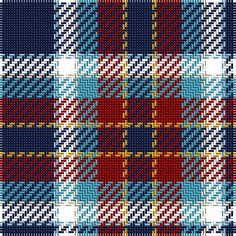

The parent of this is [Wingtip](/tartans/db/22/lb2/o6/ly2/b8/dr10/y2/db/10/)

This was sourced from register-of-tartans.  It is a [8 stripes tartan](/stripes/stripes8/).

Original link https://www.tartanregister.gov.uk/tartanDetails.aspx?ref=11302

## Thread count
DB/22 LB2 O6 LY2 B8 DR10 Y2 DB/10

## Palette
Each colour and its ΔE from the base-6 reference it is a variant of.

| Colour | Shade | Base | ΔE (OKLab) |
|---|---|---|---|
| B |  `#48A4C0` | Y  | 0.28 |
| DB |  `#141E46` | B  | 0.15 |
| DR |  `#880000` | R  | 0.14 |
| LB |  `#98C8E8` | W  | 0.17 |
| LY |  `#F8F4D0` | W  | 0.04 |
| Y |  `#E0A126` | Y  | 0.08 |

# Sample pattern

ID: /variants/db/22/lb2/o6/ly2/b8/dr10/y2/db/10-b48a4c0-db141e46-dr880000-lb98c8e8-lyf8f4d0-ye0a126/
