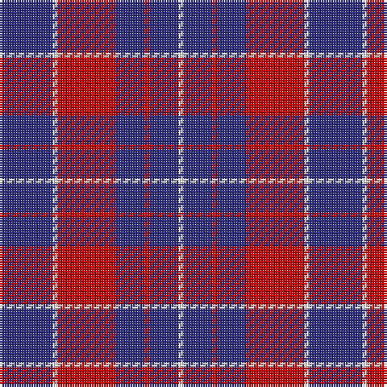

The parent of this is [Coronation (1936) #2 (Commemorative)](/tartans/db/22/w2/r24/db12/r2/db12/w/2/)

This was sourced from tartans-authority.  It is a [7 stripes tartan](/stripes/stripes7/).

Original link http://www.tartansauthority.com/tartan-ferret/display/2082/

## Thread count
DB/22 W2 R24 DB12 R2 DB12 W/2

## Palette
Each colour and its ΔE from the base-6 reference it is a variant of.

| Colour | Shade | Base | ΔE (OKLab) |
|---|---|---|---|
| DB |  `#2C2C80` | B  | 0.05 |
| R |  `#C80000` | R  | 0.00 |
| W |  `#FCFCFC` | W  | 0.03 |

# Sample pattern

ID: /variants/db/22/w2/r24/db12/r2/db12/w/2-db2c2c80-rc80000-wfcfcfc/
