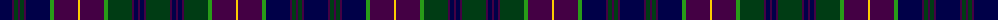

The parent of this is [O'Connor, Hugh (Personal)](/tartans/db/24/dp2/dg4/dp2/dg4/dp2/db24/g4/dp24/y2/dp24/g4/dg24/dp2/db4/dp2/db4/dp2/dg/24/)

This was sourced from register-of-tartans.  It is a [19 stripes tartan](/stripes/stripes19/).

Original link https://www.tartanregister.gov.uk/tartanDetails.aspx?ref=11339

## Thread count
DB/24 DP2 DG4 DP2 DG4 DP2 DB24 G4 DP24 Y2 DP24 G4 DG24 DP2 DB4 DP2 DB4 DP2 DG/24

## Palette
Each colour and its ΔE from the base-6 reference it is a variant of.

| Colour | Shade | Base | ΔE (OKLab) |
|---|---|---|---|
| DB |  `#000048` | B  | 0.21 |
| DG |  `#003C14` | G  | 0.14 |
| DP |  `#440044` | B  | 0.17 |
| G |  `#289C18` | G  | 0.18 |
| Y |  `#FCCC00` | Y  | 0.04 |

ID: /variants/db/24/dp2/dg4/dp2/dg4/dp2/db24/g4/dp24/y2/dp24/g4/dg24/dp2/db4/dp2/db4/dp2/dg/24-db000048-dg003c14-dp440044-g289c18-yfccc00/
