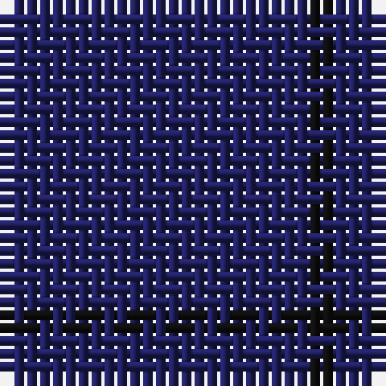

The parent of this is [Staines](/tartans/db/24/k/2/)

This was sourced from tartans-authority.  It is a [2 stripes tartan](/stripes/stripes2/).

Original link http://www.tartansauthority.com/tartan-ferret/display/10857/

## Thread count
DB/24 K/2

## Palette
Each colour and its ΔE from the base-6 reference it is a variant of.

| Colour | Shade | Base | ΔE (OKLab) |
|---|---|---|---|
| DB |  `#202060` | B  | 0.11 |
| K |  `#101010` | K  | 0.17 |

# Sample pattern

ID: /variants/db/24/k/2-db202060-k101010/
