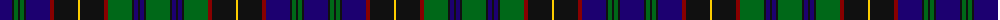

The parent of this is [Ochiltree (Name)](/tartans/db/24/k2/g4/k2/g4/k2/db24/dr4/k24/y2/k24/dr4/g24/k2/db4/k2/db4/k2/g/24/)

This was sourced from tartans-authority.  It is a [19 stripes tartan](/stripes/stripes19/).

Original link http://www.tartansauthority.com/tartan-ferret/display/321/

## Thread count
DB/24 K2 G4 K2 G4 K2 DB24 DR4 K24 Y2 K24 DR4 G24 K2 DB4 K2 DB4 K2 G/24

## Palette
Each colour and its ΔE from the base-6 reference it is a variant of.

| Colour | Shade | Base | ΔE (OKLab) |
|---|---|---|---|
| DB |  `#1C0070` | B  | 0.14 |
| DR |  `#880000` | R  | 0.14 |
| G |  `#006818` | G  | 0.02 |
| K |  `#101010` | K  | 0.17 |
| Y |  `#FCCC00` | Y  | 0.04 |

ID: /variants/db/24/k2/g4/k2/g4/k2/db24/dr4/k24/y2/k24/dr4/g24/k2/db4/k2/db4/k2/g/24-db1c0070-dr880000-g006818-k101010-yfccc00/
