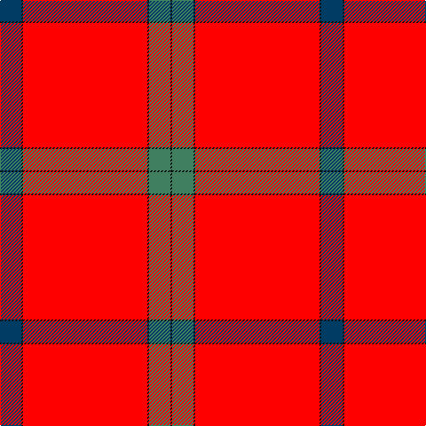

The parent of this is [Lawers Estate](/tartans/db/24/k2/r140/k2/g24/k/2/)

This was sourced from register-of-tartans.  It is a [6 stripes tartan](/stripes/stripes6/).

Original link https://www.tartanregister.gov.uk/tartanDetails.aspx?ref=2067

## Thread count
DB/24 K2 R140 K2 G24 K/2

## Palette
Each colour and its ΔE from the base-6 reference it is a variant of.

| Colour | Shade | Base | ΔE (OKLab) |
|---|---|---|---|
| DB |  `#003C64` | B  | 0.07 |
| G |  `#408060` | G  | 0.13 |
| K |  `#101010` | K  | 0.17 |
| R |  `#FF0000` | R  | 0.11 |

# Sample pattern

ID: /variants/db/24/k2/r140/k2/g24/k/2-db003c64-g408060-k101010-rff0000/
