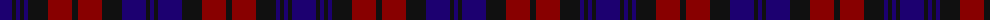

The parent of this is [MacDevitt (Name)](/tartans/db/24/k4/db4/k4/db4/k20/dr24/k6/dr24/k20/db24/k4/db/4/)

This was sourced from tartans-authority.  It is a [13 stripes tartan](/stripes/stripes13/).

Original link http://www.tartansauthority.com/tartan-ferret/display/3347/

## Thread count
DB/24 K4 DB4 K4 DB4 K20 DR24 K6 DR24 K20 DB24 K4 DB/4

## Palette
Each colour and its ΔE from the base-6 reference it is a variant of.

| Colour | Shade | Base | ΔE (OKLab) |
|---|---|---|---|
| DB |  `#1C0070` | B  | 0.14 |
| DR |  `#880000` | R  | 0.14 |
| K |  `#101010` | K  | 0.17 |

ID: /variants/db/24/k4/db4/k4/db4/k20/dr24/k6/dr24/k20/db24/k4/db/4-db1c0070-dr880000-k101010/
