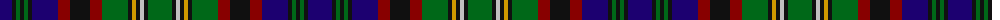

The parent of this is [Cunningham Htg (Clan)](/tartans/db/24/k4/g4/k4/g4/k4/db26/dr12/k20/dr12/g26/k4/dy4/k4/n4/k4/g/24/)

This was sourced from tartans-authority.  It is a [17 stripes tartan](/stripes/stripes17/).

Original link http://www.tartansauthority.com/tartan-ferret/display/1972/

## Thread count
DB/24 K4 G4 K4 G4 K4 DB26 DR12 K20 DR12 G26 K4 DY4 K4 N4 K4 G/24

## Palette
Each colour and its ΔE from the base-6 reference it is a variant of.

| Colour | Shade | Base | ΔE (OKLab) |
|---|---|---|---|
| DB |  `#1C0070` | B  | 0.14 |
| DR |  `#880000` | R  | 0.14 |
| DY |  `#D09800` | Y  | 0.11 |
| G |  `#006818` | G  | 0.02 |
| K |  `#101010` | K  | 0.17 |
| N |  `#C0C0C0` | W  | 0.16 |

ID: /variants/db/24/k4/g4/k4/g4/k4/db26/dr12/k20/dr12/g26/k4/dy4/k4/n4/k4/g/24-db1c0070-dr880000-dyd09800-g006818-k101010-nc0c0c0/
