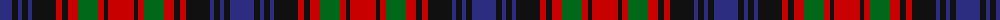

The parent of this is [Bonnar (Name)](/tartans/db/24/k6/db4/k6/db4/k24/r6/k6/r10/g20/r6/k4/r/26/)

This was sourced from tartans-authority.  It is a [13 stripes tartan](/stripes/stripes13/).

Original link http://www.tartansauthority.com/tartan-ferret/display/285/

## Thread count
DB/24 K6 DB4 K6 DB4 K24 R6 K6 R10 G20 R6 K4 R/26

## Palette
Each colour and its ΔE from the base-6 reference it is a variant of.

| Colour | Shade | Base | ΔE (OKLab) |
|---|---|---|---|
| DB |  `#2C2C80` | B  | 0.05 |
| G |  `#006818` | G  | 0.02 |
| K |  `#101010` | K  | 0.17 |
| R |  `#C80000` | R  | 0.00 |

ID: /variants/db/24/k6/db4/k6/db4/k24/r6/k6/r10/g20/r6/k4/r/26-db2c2c80-g006818-k101010-rc80000/
