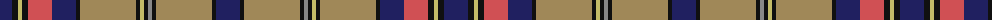

The parent of this is [Oneness](/tartans/db/24/k6/lg4/k6/do24/db24/k4/lt56/k4/lg4/k4/n4/k4/lt56/k4/db/24/)

This was sourced from tartans-authority.  It is a [16 stripes tartan](/stripes/stripes16/).

Original link http://www.tartansauthority.com/tartan-ferret/display/11102/

## Thread count
DB/24 K6 LG4 K6 DO24 DB24 K4 LT56 K4 LG4 K4 N4 K4 LT56 K4 DB/24

## Palette
Each colour and its ΔE from the base-6 reference it is a variant of.

| Colour | Shade | Base | ΔE (OKLab) |
|---|---|---|---|
| DB |  `#202060` | B  | 0.11 |
| DO |  `#D05054` | R  | 0.10 |
| K |  `#101010` | K  | 0.17 |
| LG |  `#C4BC68` | Y  | 0.07 |
| LT |  `#A08858` | Y  | 0.21 |
| N |  `#888888` | R  | 0.24 |

ID: /variants/db/24/k6/lg4/k6/do24/db24/k4/lt56/k4/lg4/k4/n4/k4/lt56/k4/db/24-db202060-dod05054-k101010-lgc4bc68-lta08858-n888888/
