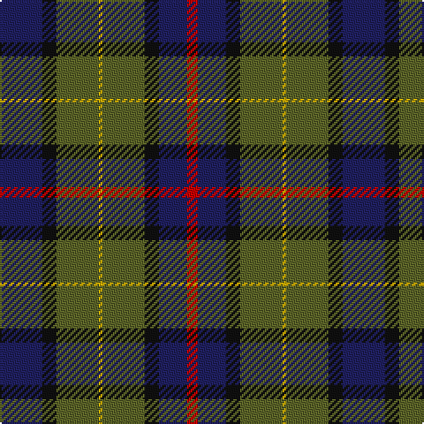

The parent of this is [Art Pewter Silver (Corporate)](/tartans/db/24/k8/g24/y2/g24/k8/db16/r/6/)

This was sourced from tartans-authority.  It is a [8 stripes tartan](/stripes/stripes8/).

Original link http://www.tartansauthority.com/tartan-ferret/display/3021/

## Thread count
DB/24 K8 G24 Y2 G24 K8 DB16 R/6

## Palette
Each colour and its ΔE from the base-6 reference it is a variant of.

| Colour | Shade | Base | ΔE (OKLab) |
|---|---|---|---|
| DB |  `#202060` | B  | 0.11 |
| G |  `#5C6428` | G  | 0.09 |
| K |  `#101010` | K  | 0.17 |
| R |  `#C80000` | R  | 0.00 |
| Y |  `#D8B000` | Y  | 0.05 |

# Sample pattern

ID: /variants/db/24/k8/g24/y2/g24/k8/db16/r/6-db202060-g5c6428-k101010-rc80000-yd8b000/
