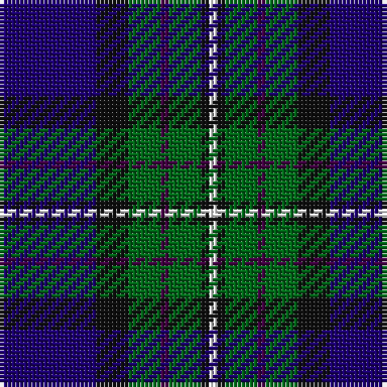

The parent of this is [Alexander - 2000 (Name)](/tartans/db/24/k8/g8/dp2/g8/k2/w/2/)

This was sourced from tartans-authority.  It is a [7 stripes tartan](/stripes/stripes7/).

Original link http://www.tartansauthority.com/tartan-ferret/display/5686/

## Thread count
DB/24 K8 G8 DP2 G8 K2 W/2

## Palette
Each colour and its ΔE from the base-6 reference it is a variant of.

| Colour | Shade | Base | ΔE (OKLab) |
|---|---|---|---|
| DB |  `#1C0070` | B  | 0.14 |
| DP |  `#440044` | B  | 0.17 |
| G |  `#006818` | G  | 0.02 |
| K |  `#101010` | K  | 0.17 |
| W |  `#FCFCFC` | W  | 0.03 |

# Sample pattern

ID: /variants/db/24/k8/g8/dp2/g8/k2/w/2-db1c0070-dp440044-g006818-k101010-wfcfcfc/
