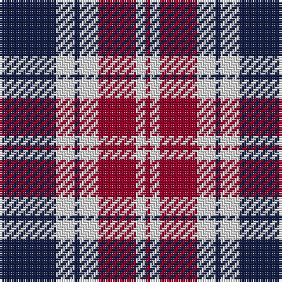

The parent of this is [Sunderland](/tartans/db/24/ln8/db2/ln8/dr16/ln4/dr/2/)

This was sourced from register-of-tartans.  It is a [7 stripes tartan](/stripes/stripes7/).

Original link https://www.tartanregister.gov.uk/tartanDetails.aspx?ref=5953

## Thread count
DB/24 LN8 DB2 LN8 DR16 LN4 DR/2

## Palette
Each colour and its ΔE from the base-6 reference it is a variant of.

| Colour | Shade | Base | ΔE (OKLab) |
|---|---|---|---|
| DB |  `#141E46` | B  | 0.15 |
| DR |  `#960028` | R  | 0.11 |
| LN |  `#E0E0E0` | W  | 0.06 |

# Sample pattern

ID: /variants/db/24/ln8/db2/ln8/dr16/ln4/dr/2-db141e46-dr960028-lne0e0e0/
