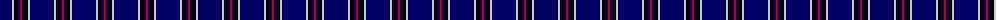
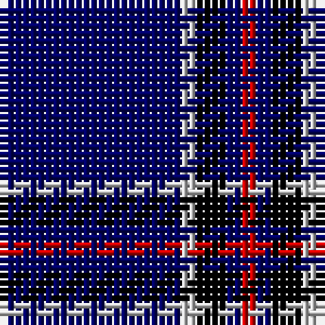

The parent of this is [Lochcarron (1985) (Fashion)](/tartans/db/24/n2/k4/db2/r/2/)

This was sourced from tartans-authority.  It is a [5 stripes tartan](/stripes/stripes5/).

Original link http://www.tartansauthority.com/tartan-ferret/display/5462/

## Thread count
DB/24 N2 K4 DB2 R/2

## Palette
Each colour and its ΔE from the base-6 reference it is a variant of.

| Colour | Shade | Base | ΔE (OKLab) |
|---|---|---|---|
| DB |  `#000064` | B  | 0.17 |
| K |  `#000000` | K  | 0.00 |
| N |  `#C8C8C8` | W  | 0.13 |
| R |  `#C80000` | R  | 0.00 |

# Sample pattern

ID: /variants/db/24/n2/k4/db2/r/2-db000064-k000000-nc8c8c8-rc80000/
