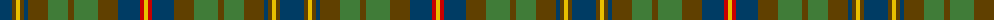

The parent of this is [MacVicker (Name)](/tartans/db/24/t4/y4/t4/db4/t20/g20/t6/g24/t20/db22/r4/y/4/)

This was sourced from tartans-authority.  It is a [13 stripes tartan](/stripes/stripes13/).

Original link http://www.tartansauthority.com/tartan-ferret/display/10032/

## Thread count
DB/24 T4 Y4 T4 DB4 T20 G20 T6 G24 T20 DB22 R4 Y/4

## Palette
Each colour and its ΔE from the base-6 reference it is a variant of.

| Colour | Shade | Base | ΔE (OKLab) |
|---|---|---|---|
| DB |  `#003C64` | B  | 0.07 |
| G |  `#407C38` | G  | 0.10 |
| R |  `#C80000` | R  | 0.00 |
| T |  `#604000` | G  | 0.14 |
| Y |  `#E8C000` | Y  | 0.00 |

ID: /variants/db/24/t4/y4/t4/db4/t20/g20/t6/g24/t20/db22/r4/y/4-db003c64-g407c38-rc80000-t604000-ye8c000/
