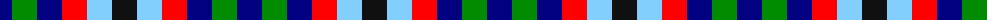
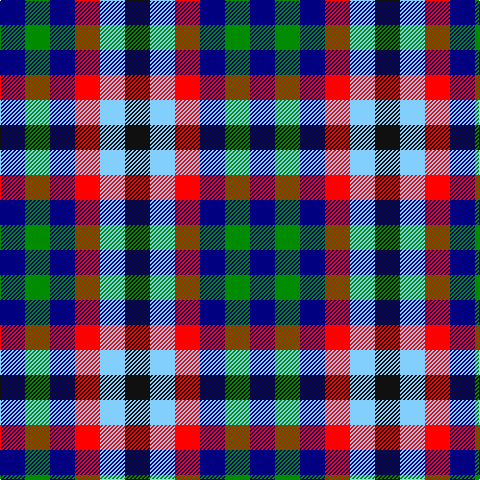

The parent of this is [Antonelli (Oklahoma), John (Personal)](/tartans/db/25/g25/db25/r25/lb25/k/25/)

This was sourced from register-of-tartans.  It is a [6 stripes tartan](/stripes/stripes6/).

Original link https://www.tartanregister.gov.uk/tartanDetails.aspx?ref=10453

## Thread count
DB/25 G25 DB25 R25 LB25 K/25

## Palette
Each colour and its ΔE from the base-6 reference it is a variant of.

| Colour | Shade | Base | ΔE (OKLab) |
|---|---|---|---|
| DB |  `#000080` | B  | 0.14 |
| G |  `#008B00` | G  | 0.12 |
| K |  `#101010` | K  | 0.17 |
| LB |  `#82CFFD` | W  | 0.18 |
| R |  `#FF0000` | R  | 0.11 |

# Sample pattern

ID: /variants/db/25/g25/db25/r25/lb25/k/25-db000080-g008b00-k101010-lb82cffd-rff0000/
