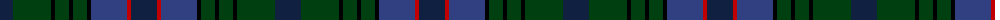

The parent of this is [South Australia](/tartans/db/26/dg38/k4/dg14/k4/dg14/k4/b36/r4/db/26/)

This was sourced from weddslist.  It is a [10 stripes tartan](/stripes/stripes10/).

Original link http://www.weddslist.com/cgi-bin/tartans/pg.pl?source=sts

## Thread count
DB/26 DG38 K4 DG14 K4 DG14 K4 B36 R4 DB/26

## Palette
Each colour and its ΔE from the base-6 reference it is a variant of.

| Colour | Shade | Base | ΔE (OKLab) |
|---|---|---|---|
| B |  `#304080` | B  | 0.01 |
| DB |  `#102040` | B  | 0.15 |
| DG |  `#004010` | G  | 0.12 |
| K |  `#000000` | K  | 0.00 |
| R |  `#C00000` | R  | 0.02 |

ID: /variants/db/26/dg38/k4/dg14/k4/dg14/k4/b36/r4/db/26-b304080-db102040-dg004010-k000000-rc00000/
