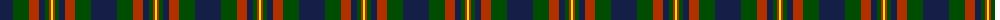
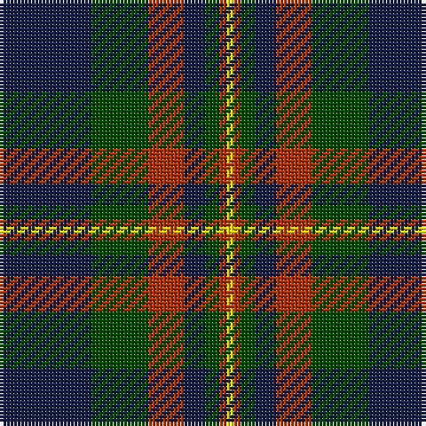

The parent of this is [Fibonacci7](/tartans/db/26/g16/r10/db6/g4/r2/y/2/)

This was sourced from register-of-tartans.  It is a [7 stripes tartan](/stripes/stripes7/).

Original link https://www.tartanregister.gov.uk/tartanDetails.aspx?ref=11454

## Thread count
DB/26 G16 R10 DB6 G4 R2 Y/2

## Palette
Each colour and its ΔE from the base-6 reference it is a variant of.

| Colour | Shade | Base | ΔE (OKLab) |
|---|---|---|---|
| DB |  `#141E46` | B  | 0.15 |
| G |  `#004C00` | G  | 0.08 |
| R |  `#B03000` | R  | 0.05 |
| Y |  `#FFE600` | Y  | 0.10 |

# Sample pattern

ID: /variants/db/26/g16/r10/db6/g4/r2/y/2-db141e46-g004c00-rb03000-yffe600/
