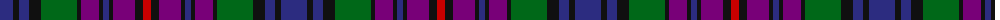

The parent of this is [Braid (Name)](/tartans/db/26/k6/db10/k12/g36/k4/p18/k4/db6/k4/p22/k8/r/8/)

This was sourced from tartans-authority.  It is a [13 stripes tartan](/stripes/stripes13/).

Original link http://www.tartansauthority.com/tartan-ferret/display/4033/

## Thread count
DB/26 K6 DB10 K12 G36 K4 P18 K4 DB6 K4 P22 K8 R/8

## Palette
Each colour and its ΔE from the base-6 reference it is a variant of.

| Colour | Shade | Base | ΔE (OKLab) |
|---|---|---|---|
| DB |  `#2C2C80` | B  | 0.05 |
| G |  `#006818` | G  | 0.02 |
| K |  `#101010` | K  | 0.17 |
| P |  `#780078` | B  | 0.16 |
| R |  `#C80000` | R  | 0.00 |

ID: /variants/db/26/k6/db10/k12/g36/k4/p18/k4/db6/k4/p22/k8/r/8-db2c2c80-g006818-k101010-p780078-rc80000/
