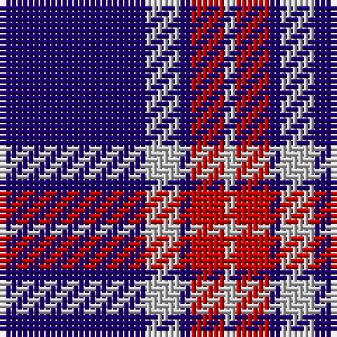

The parent of this is [Glen Moy 1986 (Fashion)](/tartans/db/26/n6/db2/r6/n/2/)

This was sourced from tartans-authority.  It is a [5 stripes tartan](/stripes/stripes5/).

Original link http://www.tartansauthority.com/tartan-ferret/display/635/

## Thread count
DB/26 N6 DB2 R6 N/2

## Palette
Each colour and its ΔE from the base-6 reference it is a variant of.

| Colour | Shade | Base | ΔE (OKLab) |
|---|---|---|---|
| DB |  `#1C0070` | B  | 0.14 |
| N |  `#C0C0C0` | W  | 0.16 |
| R |  `#C80000` | R  | 0.00 |

# Sample pattern

ID: /variants/db/26/n6/db2/r6/n/2-db1c0070-nc0c0c0-rc80000/
