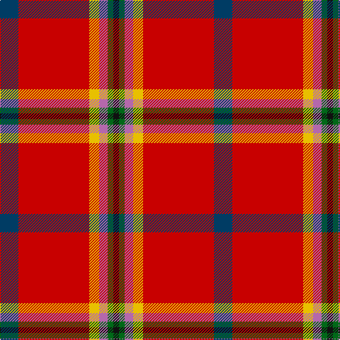

The parent of this is [Harding Personal Tartan Tartan Number: 6874. Earliest known date: 2006 Richard Scott Harding created this design so that his family could have a tartan. See products available Copyright © Blair Urquhart, Comrie, 2015](/tartans/db/26/r100/y14/p12/g8/k/8/)

This was sourced from house-of-tartan.  It is a [6 stripes tartan](/stripes/stripes6/).

Original link http://www.house-of-tartan.scotland.net/house/TartanViewjs.asp?colr=Def&tnam=6874

## Thread count
DB/26 R100 Y14 P12 G8 K/8

## Palette
Each colour and its ΔE from the base-6 reference it is a variant of.

| Colour | Shade | Base | ΔE (OKLab) |
|---|---|---|---|
| DB |  `#003C64` | B  | 0.07 |
| G |  `#006818` | G  | 0.02 |
| K |  `#101010` | K  | 0.17 |
| P |  `#B468AC` | R  | 0.21 |
| R |  `#C80000` | R  | 0.00 |
| Y |  `#E8C000` | Y  | 0.00 |

# Sample pattern

ID: /variants/db/26/r100/y14/p12/g8/k/8-db003c64-g006818-k101010-pb468ac-rc80000-ye8c000/
