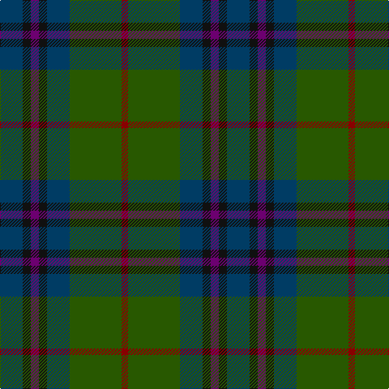

The parent of this is [Bennachie Whisky (Corporate)](/tartans/db/28/k10/p10/k10/db28/g64/dr/8/)

This was sourced from tartans-authority.  It is a [7 stripes tartan](/stripes/stripes7/).

Original link http://www.tartansauthority.com/tartan-ferret/display/4228/

## Thread count
DB/28 K10 P10 K10 DB28 G64 DR/8

## Palette
Each colour and its ΔE from the base-6 reference it is a variant of.

| Colour | Shade | Base | ΔE (OKLab) |
|---|---|---|---|
| DB |  `#003C64` | B  | 0.07 |
| DR |  `#880000` | R  | 0.14 |
| G |  `#285800` | G  | 0.04 |
| K |  `#101010` | K  | 0.17 |
| P |  `#6C0070` | B  | 0.15 |

# Sample pattern

ID: /variants/db/28/k10/p10/k10/db28/g64/dr/8-db003c64-dr880000-g285800-k101010-p6c0070/
