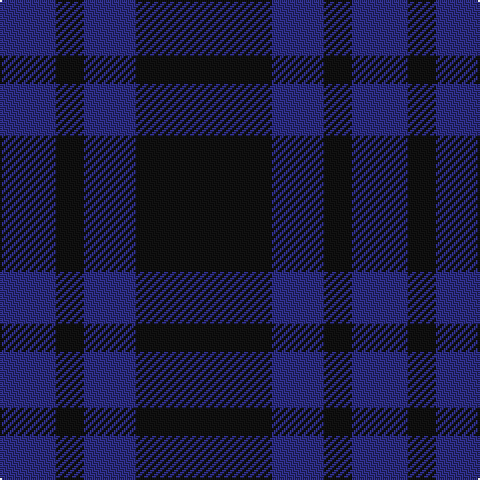

The parent of this is [Auchincloss (Name)](/tartans/db/28/k14/db26/k/68/)

This was sourced from tartans-authority.  It is a [4 stripes tartan](/stripes/stripes4/).

Original link http://www.tartansauthority.com/tartan-ferret/display/6859/

## Thread count
DB/28 K14 DB26 K/68

## Palette
Each colour and its ΔE from the base-6 reference it is a variant of.

| Colour | Shade | Base | ΔE (OKLab) |
|---|---|---|---|
| DB |  `#2C2C80` | B  | 0.05 |
| K |  `#101010` | K  | 0.17 |

# Sample pattern

ID: /variants/db/28/k14/db26/k/68-db2c2c80-k101010/
