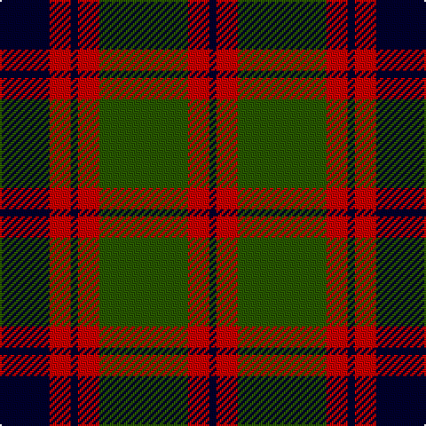

The parent of this is [Logan - 1810 (Cockburn Collection)](/tartans/db/28/r12/db4/r12/g50/r12/db/4/)

This was sourced from tartans-authority.  It is a [7 stripes tartan](/stripes/stripes7/).

Original link http://www.tartansauthority.com/tartan-ferret/display/398/

## Thread count
DB/28 R12 DB4 R12 G50 R12 DB/4

## Palette
Each colour and its ΔE from the base-6 reference it is a variant of.

| Colour | Shade | Base | ΔE (OKLab) |
|---|---|---|---|
| DB |  `#00002C` | K  | 0.16 |
| G |  `#285800` | G  | 0.04 |
| R |  `#C80000` | R  | 0.00 |

# Sample pattern

ID: /variants/db/28/r12/db4/r12/g50/r12/db/4-db00002c-g285800-rc80000/
