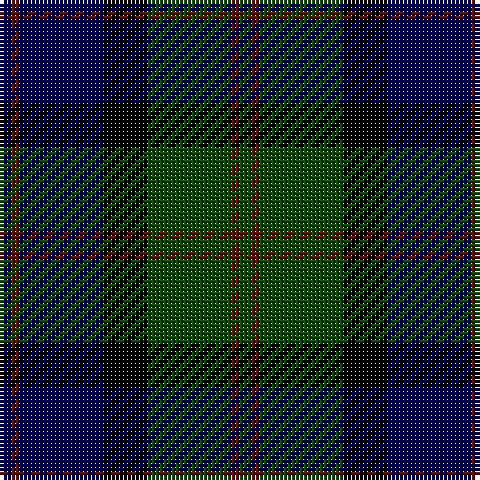

The parent of this is [MacThomas](/tartans/db/3/dr2/db21/k11/dg21/dr2/dg/3/)

This was sourced from weddslist.  It is a [7 stripes tartan](/stripes/stripes7/).

Original link http://www.weddslist.com/cgi-bin/tartans/pg.pl?source=x

## Thread count
DB/3 DR2 DB21 K11 DG21 DR2 DG/3

## Palette
Each colour and its ΔE from the base-6 reference it is a variant of.

| Colour | Shade | Base | ΔE (OKLab) |
|---|---|---|---|
| DB |  `#000052` | B  | 0.20 |
| DG |  `#11450D` | G  | 0.10 |
| DR |  `#59110D` | B  | 0.21 |
| K |  `#000000` | K  | 0.00 |

# Sample pattern

ID: /variants/db/3/dr2/db21/k11/dg21/dr2/dg/3-db000052-dg11450d-dr59110d-k000000/
