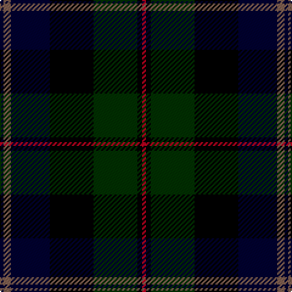

The parent of this is [McEwan "1856", The](/tartans/db/3/lt6/db32/k36/dg36/k4/r/3/)

This was sourced from weddslist.  It is a [7 stripes tartan](/stripes/stripes7/).

Original link http://www.weddslist.com/cgi-bin/tartans/pg.pl?source=sts

## Thread count
DB/3 LT6 DB32 K36 DG36 K4 R/3

## Palette
Each colour and its ΔE from the base-6 reference it is a variant of.

| Colour | Shade | Base | ΔE (OKLab) |
|---|---|---|---|
| DB |  `#000030` | K  | 0.17 |
| DG |  `#003000` | G  | 0.18 |
| K |  `#000000` | K  | 0.00 |
| LT |  `#806050` | R  | 0.17 |
| R |  `#C00020` | R  | 0.02 |

# Sample pattern

ID: /variants/db/3/lt6/db32/k36/dg36/k4/r/3-db000030-dg003000-k000000-lt806050-rc00020/
