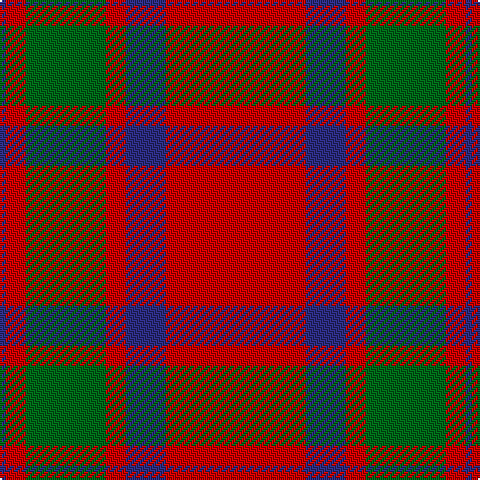

The parent of this is [MacKintosh - 1819 (Clan)](/tartans/db/3/r10/g40/r10/db20/r/70/)

This was sourced from tartans-authority.  It is a [6 stripes tartan](/stripes/stripes6/).

Original link http://www.tartansauthority.com/tartan-ferret/display/521/

## Thread count
DB/3 R10 G40 R10 DB20 R/70

## Palette
Each colour and its ΔE from the base-6 reference it is a variant of.

| Colour | Shade | Base | ΔE (OKLab) |
|---|---|---|---|
| DB |  `#2C2C80` | B  | 0.05 |
| G |  `#006818` | G  | 0.02 |
| R |  `#C80000` | R  | 0.00 |

# Sample pattern

ID: /variants/db/3/r10/g40/r10/db20/r/70-db2c2c80-g006818-rc80000/
