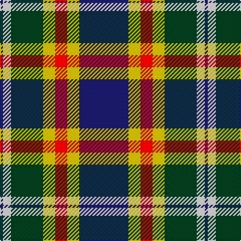

The parent of this is [Kuznetsov (2014)](/tartans/db/3/w8/dg32/y12/r12/y12/db/49/)

This was sourced from tartans-authority.  It is a [7 stripes tartan](/stripes/stripes7/).

Original link http://www.tartansauthority.com/tartan-ferret/display/11012/

## Thread count
DB/3 W8 DG32 Y12 R12 Y12 DB/49

## Palette
Each colour and its ΔE from the base-6 reference it is a variant of.

| Colour | Shade | Base | ΔE (OKLab) |
|---|---|---|---|
| DB |  `#202060` | B  | 0.11 |
| DG |  `#003820` | G  | 0.16 |
| R |  `#C80000` | R  | 0.00 |
| W |  `#FCFCFC` | W  | 0.03 |
| Y |  `#E8C000` | Y  | 0.00 |

# Sample pattern

ID: /variants/db/3/w8/dg32/y12/r12/y12/db/49-db202060-dg003820-rc80000-wfcfcfc-ye8c000/
