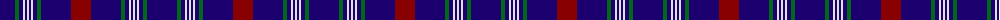

The parent of this is [Ikelman #5 (Personal)](/tartans/db/30/g4/db4/ln2/db2/ln2/db2/ln2/db4/g4/db30/dr/20/)

This was sourced from register-of-tartans.  It is a [12 stripes tartan](/stripes/stripes12/).

Original link https://www.tartanregister.gov.uk/tartanDetails.aspx?ref=1815

## Thread count
DB/30 G4 DB4 LN2 DB2 LN2 DB2 LN2 DB4 G4 DB30 DR/20

## Palette
Each colour and its ΔE from the base-6 reference it is a variant of.

| Colour | Shade | Base | ΔE (OKLab) |
|---|---|---|---|
| DB |  `#1C0070` | B  | 0.14 |
| DR |  `#880000` | R  | 0.14 |
| G |  `#006818` | G  | 0.02 |
| LN |  `#E0E0E0` | W  | 0.06 |
| N |  `#C0C0C0` | W  | 0.16 |

ID: /variants/db/30/g4/db4/ln2/db2/ln2/db2/ln2/db4/g4/db30/dr/20-db1c0070-dr880000-g006818-lne0e0e0-nc0c0c0/
