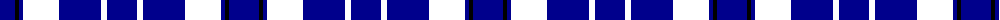

The parent of this is [Loyalhanna (District?)](/tartans/db/30/k4/dba4/wy30/r6/db42/r6/dba/30/)

This was sourced from tartans-authority.  It is a [8 stripes tartan](/stripes/stripes8/).

Original link http://www.tartansauthority.com/tartan-ferret/display/5506/

## Thread count
DB/30 K4 DBa4 WY30 R6 DB42 R6 DBa/30

## Palette
Each colour and its ΔE from the base-6 reference it is a variant of.

| Colour | Shade | Base | ΔE (OKLab) |
|---|---|---|---|
| DB |  `#00008C` | B  | 0.13 |
| DBa |  `#00008C` | B  | 0.13 |
| K |  `#000000` | K  | 0.00 |

# Sample pattern

ID: /variants/db/30/k4/dba4/wy30/r6/db42/r6/dba/30-db00008c-dba00008c-k000000/
