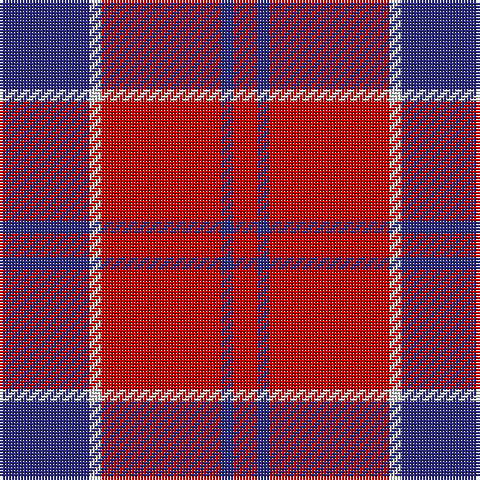

The parent of this is [Masai Shuka 25 (Artefact)](/tartans/db/30/ln4/r40/db4/r/8/)

This was sourced from tartans-authority.  It is a [5 stripes tartan](/stripes/stripes5/).

Original link http://www.tartansauthority.com/tartan-ferret/display/7285/

## Thread count
DB/30 LN4 R40 DB4 R/8

## Palette
Each colour and its ΔE from the base-6 reference it is a variant of.

| Colour | Shade | Base | ΔE (OKLab) |
|---|---|---|---|
| DB |  `#2C2C80` | B  | 0.05 |
| LN |  `#E0E0E0` | W  | 0.06 |
| R |  `#C80000` | R  | 0.00 |

# Sample pattern

ID: /variants/db/30/ln4/r40/db4/r/8-db2c2c80-lne0e0e0-rc80000/
