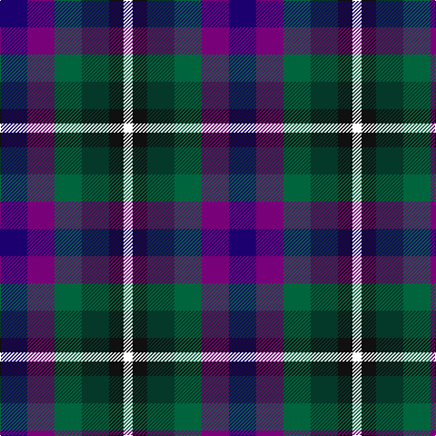

The parent of this is [Williams, Edmund (Personal)](/tartans/db/30/p30/g30/dg30/k16/w/10/)

This was sourced from register-of-tartans.  It is a [6 stripes tartan](/stripes/stripes6/).

Original link https://www.tartanregister.gov.uk/tartanDetails.aspx?ref=10872

## Thread count
DB/30 P30 G30 DG30 K16 W/10

## Palette
Each colour and its ΔE from the base-6 reference it is a variant of.

| Colour | Shade | Base | ΔE (OKLab) |
|---|---|---|---|
| DB |  `#1C0070` | B  | 0.14 |
| DG |  `#043828` | G  | 0.16 |
| G |  `#00643C` | G  | 0.06 |
| K |  `#101010` | K  | 0.17 |
| P |  `#780078` | B  | 0.16 |
| W |  `#FFFFFF` | W  | 0.03 |

# Sample pattern

ID: /variants/db/30/p30/g30/dg30/k16/w/10-db1c0070-dg043828-g00643c-k101010-p780078-wffffff/
