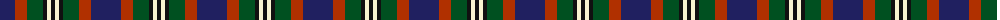
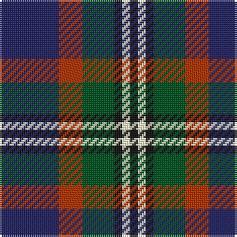

The parent of this is [Stovell (2015)](/tartans/db/30/r12/g16/k4/ly4/k/4/)

This was sourced from register-of-tartans.  It is a [6 stripes tartan](/stripes/stripes6/).

Original link https://www.tartanregister.gov.uk/tartanDetails.aspx?ref=11348

## Thread count
DB/30 R12 G16 K4 LY4 K/4

## Palette
Each colour and its ΔE from the base-6 reference it is a variant of.

| Colour | Shade | Base | ΔE (OKLab) |
|---|---|---|---|
| DB |  `#202060` | B  | 0.11 |
| G |  `#005020` | G  | 0.08 |
| K |  `#101010` | K  | 0.17 |
| LY |  `#F8F4D0` | W  | 0.04 |
| R |  `#B03000` | R  | 0.05 |

# Sample pattern

ID: /variants/db/30/r12/g16/k4/ly4/k/4-db202060-g005020-k101010-lyf8f4d0-rb03000/
