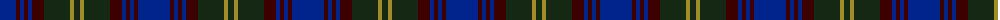

The parent of this is [Christian Dewar (Personal)](/tartans/db/32/dr4/db4/dr4/db4/dr12/k26/lt4/k/6/)

This was sourced from register-of-tartans.  It is a [9 stripes tartan](/stripes/stripes9/).

Original link https://www.tartanregister.gov.uk/tartanDetails.aspx?ref=645

## Thread count
DB/32 DR4 DB4 DR4 DB4 DR12 K26 LT4 K/6

## Palette
Each colour and its ΔE from the base-6 reference it is a variant of.

| Colour | Shade | Base | ΔE (OKLab) |
|---|---|---|---|
| DB |  `#00248C` | B  | 0.09 |
| DR |  `#3C0000` | K  | 0.24 |
| K |  `#142814` | B  | 0.20 |
| LT |  `#A08C28` | Y  | 0.19 |

ID: /variants/db/32/dr4/db4/dr4/db4/dr12/k26/lt4/k/6-db00248c-dr3c0000-k142814-lta08c28/
