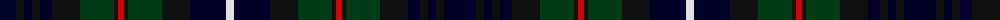

The parent of this is [Humphries (Personal)](/tartans/db/32/k8/db8/k8/db12/k28/dg34/k4/r6/k4/dg34/k28/db36/ln/8/)

This was sourced from register-of-tartans.  It is a [14 stripes tartan](/stripes/stripes14/).

Original link https://www.tartanregister.gov.uk/tartanDetails.aspx?ref=1784

## Thread count
DB/32 K8 DB8 K8 DB12 K28 DG34 K4 R6 K4 DG34 K28 DB36 LN/8

## Palette
Each colour and its ΔE from the base-6 reference it is a variant of.

| Colour | Shade | Base | ΔE (OKLab) |
|---|---|---|---|
| DB |  `#000028` | K  | 0.15 |
| DG |  `#003C14` | G  | 0.14 |
| K |  `#101010` | K  | 0.17 |
| LN |  `#E0E0E0` | W  | 0.06 |
| R |  `#DC0000` | R  | 0.04 |

ID: /variants/db/32/k8/db8/k8/db12/k28/dg34/k4/r6/k4/dg34/k28/db36/ln/8-db000028-dg003c14-k101010-lne0e0e0-rdc0000/
