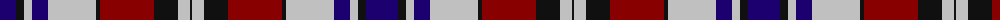

The parent of this is [Quebec Centennial #2](/tartans/db/32/k8/n8/db16/n48/k4/dr6/dr40/dr8/k24/n12/k/2/)

This was sourced from register-of-tartans.  It is a [12 stripes tartan](/stripes/stripes12/).

Original link https://www.tartanregister.gov.uk/tartanDetails.aspx?ref=5212

## Thread count
DB/32 K8 N8 DB16 N48 K4 DR6 DR40 DR8 K24 N12 K/2

## Palette
Each colour and its ΔE from the base-6 reference it is a variant of.

| Colour | Shade | Base | ΔE (OKLab) |
|---|---|---|---|
| DB |  `#1C0070` | B  | 0.14 |
| DR |  `#880000` | R  | 0.14 |
| K |  `#101010` | K  | 0.17 |
| N |  `#C0C0C0` | W  | 0.16 |

ID: /variants/db/32/k8/n8/db16/n48/k4/dr6/dr40/dr8/k24/n12/k/2-db1c0070-dr880000-k101010-nc0c0c0/
