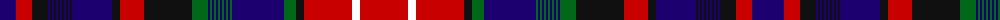

The parent of this is [Canadian Confederation (Commemorat)](/tartans/db/32/r16/k16/db2/k2/db2/k2/db2/k2/db2/k2/db2/k2/db2/k2/db40/k8/r24/k48/g16/db2/g2/db2/g2/db2/g2/db2/g2/db2/g2/db2/g2/db52/g12/k8/r48/w8/r/48/)

This was sourced from tartans-authority.  It is a [38 stripes tartan](/stripes/stripes38/).

Original link http://www.tartansauthority.com/tartan-ferret/display/1964/

## Thread count
DB/32 R16 K16 DB2 K2 DB2 K2 DB2 K2 DB2 K2 DB2 K2 DB2 K2 DB40 K8 R24 K48 G16 DB2 G2 DB2 G2 DB2 G2 DB2 G2 DB2 G2 DB2 G2 DB52 G12 K8 R48 W8 R/48

## Palette
Each colour and its ΔE from the base-6 reference it is a variant of.

| Colour | Shade | Base | ΔE (OKLab) |
|---|---|---|---|
| DB |  `#1C0070` | B  | 0.14 |
| G |  `#006818` | G  | 0.02 |
| K |  `#101010` | K  | 0.17 |
| R |  `#C80000` | R  | 0.00 |
| W |  `#FCFCFC` | W  | 0.03 |

ID: /variants/db/32/r16/k16/db2/k2/db2/k2/db2/k2/db2/k2/db2/k2/db2/k2/db40/k8/r24/k48/g16/db2/g2/db2/g2/db2/g2/db2/g2/db2/g2/db2/g2/db52/g12/k8/r48/w8/r/48-db1c0070-g006818-k101010-rc80000-wfcfcfc/
