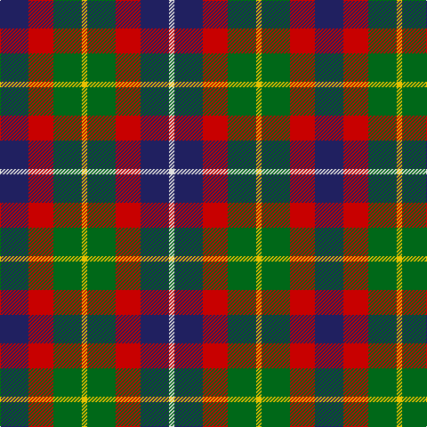

The parent of this is [Forrester (James) (Personal)](/tartans/db/32/r28/g32/y6/g32/r28/db32/ln/6/)

This was sourced from tartans-authority.  It is a [8 stripes tartan](/stripes/stripes8/).

Original link http://www.tartansauthority.com/tartan-ferret/display/2386/

## Thread count
DB/32 R28 G32 Y6 G32 R28 DB32 LN/6

## Palette
Each colour and its ΔE from the base-6 reference it is a variant of.

| Colour | Shade | Base | ΔE (OKLab) |
|---|---|---|---|
| DB |  `#202060` | B  | 0.11 |
| G |  `#006818` | G  | 0.02 |
| LN |  `#E0E0E0` | W  | 0.06 |
| R |  `#C80000` | R  | 0.00 |
| Y |  `#E8C000` | Y  | 0.00 |

# Sample pattern

ID: /variants/db/32/r28/g32/y6/g32/r28/db32/ln/6-db202060-g006818-lne0e0e0-rc80000-ye8c000/
