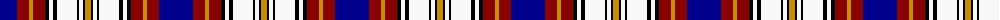

The parent of this is [Chieftain, The (Fashion)](/tartans/db/34/dr12/dy4/dr12/k4/w4/k4/w20/k2/w4/k2/dy/6/)

This was sourced from tartans-authority.  It is a [12 stripes tartan](/stripes/stripes12/).

Original link http://www.tartansauthority.com/tartan-ferret/display/4503/

## Thread count
DB/34 DR12 DY4 DR12 K4 W4 K4 W20 K2 W4 K2 DY/6

## Palette
Each colour and its ΔE from the base-6 reference it is a variant of.

| Colour | Shade | Base | ΔE (OKLab) |
|---|---|---|---|
| DB |  `#00008C` | B  | 0.13 |
| DR |  `#880000` | R  | 0.14 |
| DY |  `#C88C00` | Y  | 0.15 |
| K |  `#000000` | K  | 0.00 |
| W |  `#F8F8F8` | W  | 0.01 |

ID: /variants/db/34/dr12/dy4/dr12/k4/w4/k4/w20/k2/w4/k2/dy/6-db00008c-dr880000-dyc88c00-k000000-wf8f8f8/
