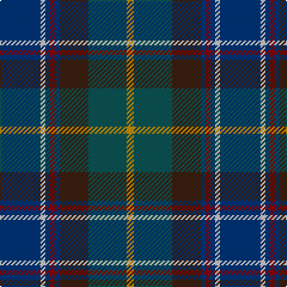

The parent of this is [Blairmore Corporate School Tartan Tartan Number: 2221. Earliest known date: 2002 Designed by John B Gillespie (Johnsons of Elgin) and Monique Baumann for Blairmore School at Glass in Aberdeenshire. See products available Copyright © Blair Urquhart, Comrie, 2015](/tartans/db/34/n4/db4/dr4/db4/k24/g32/dy/6/)

This was sourced from house-of-tartan.  It is a [8 stripes tartan](/stripes/stripes8/).

Original link http://www.house-of-tartan.scotland.net/house/TartanViewjs.asp?colr=Def&tnam=2221

## Thread count
DB/34 N4 DB4 DR4 DB4 K24 G32 DY/6

## Palette
Each colour and its ΔE from the base-6 reference it is a variant of.

| Colour | Shade | Base | ΔE (OKLab) |
|---|---|---|---|
| DB |  `#003478` | B  | 0.06 |
| DR |  `#8C0000` | R  | 0.13 |
| DY |  `#C88C00` | Y  | 0.15 |
| G |  `#0C5454` | B  | 0.12 |
| K |  `#3C2010` | B  | 0.20 |
| N |  `#C8C8C8` | W  | 0.13 |

# Sample pattern

ID: /variants/db/34/n4/db4/dr4/db4/k24/g32/dy/6-db003478-dr8c0000-dyc88c00-g0c5454-k3c2010-nc8c8c8/
