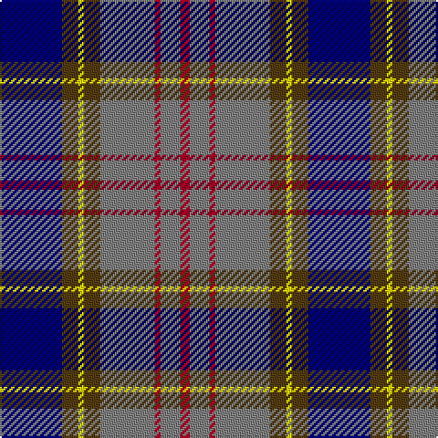

The parent of this is [Ballantyne (Personal) STWR](/tartans/db/34/t9/y3/t9/n30/dr3/n11/dr/5/)

This was sourced from register-of-tartans.  It is a [8 stripes tartan](/stripes/stripes8/).

Original link https://www.tartanregister.gov.uk/tartanDetails.aspx?ref=5980

## Thread count
DB/34 T9 Y3 T9 N30 DR3 N11 DR/5

## Palette
Each colour and its ΔE from the base-6 reference it is a variant of.

| Colour | Shade | Base | ΔE (OKLab) |
|---|---|---|---|
| DB |  `#000064` | B  | 0.17 |
| DR |  `#960028` | R  | 0.11 |
| N |  `#808080` | G  | 0.22 |
| T |  `#503C14` | G  | 0.15 |
| Y |  `#FADC00` | Y  | 0.08 |

# Sample pattern

ID: /variants/db/34/t9/y3/t9/n30/dr3/n11/dr/5-db000064-dr960028-n808080-t503c14-yfadc00/
