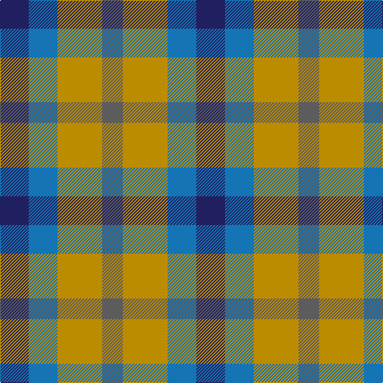

The parent of this is [Gold Country (District)](/tartans/db/36/b36/dy56/n/26/)

This was sourced from tartans-authority.  It is a [4 stripes tartan](/stripes/stripes4/).

Original link http://www.tartansauthority.com/tartan-ferret/display/10489/

## Thread count
DB/36 B36 DY56 N/26

## Palette
Each colour and its ΔE from the base-6 reference it is a variant of.

| Colour | Shade | Base | ΔE (OKLab) |
|---|---|---|---|
| B |  `#1474B4` | B  | 0.15 |
| DB |  `#202060` | B  | 0.11 |
| DY |  `#BC8C00` | Y  | 0.16 |
| N |  `#5C5C5C` | B  | 0.14 |

# Sample pattern

ID: /variants/db/36/b36/dy56/n/26-b1474b4-db202060-dybc8c00-n5c5c5c/
