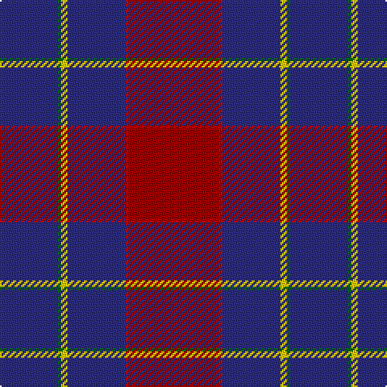

The parent of this is [European Judo Union](/tartans/db/36/g2/y4/db36/r2/dr/56/)

This was sourced from tartans-authority.  It is a [6 stripes tartan](/stripes/stripes6/).

Original link http://www.tartansauthority.com/tartan-ferret/display/11221/

## Thread count
DB/36 G2 Y4 DB36 R2 DR/56

## Palette
Each colour and its ΔE from the base-6 reference it is a variant of.

| Colour | Shade | Base | ΔE (OKLab) |
|---|---|---|---|
| DB |  `#2C2C80` | B  | 0.05 |
| DR |  `#A00000` | R  | 0.09 |
| G |  `#006818` | G  | 0.02 |
| R |  `#C80000` | R  | 0.00 |
| Y |  `#FCCC00` | Y  | 0.04 |

# Sample pattern

ID: /variants/db/36/g2/y4/db36/r2/dr/56-db2c2c80-dra00000-g006818-rc80000-yfccc00/
