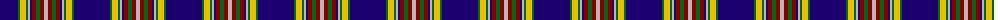

The parent of this is [Anthony Plaid Blue](/tartans/db/36/g2/y6/g2/n2/db2/dr4/g4/dr4/n/4/)

This was sourced from register-of-tartans.  It is a [10 stripes tartan](/stripes/stripes10/).

Original link https://www.tartanregister.gov.uk/tartanDetails.aspx?ref=5018

## Thread count
DB/36 G2 Y6 G2 N2 DB2 DR4 G4 DR4 N/4

## Palette
Each colour and its ΔE from the base-6 reference it is a variant of.

| Colour | Shade | Base | ΔE (OKLab) |
|---|---|---|---|
| DB |  `#1C0070` | B  | 0.14 |
| DR |  `#880000` | R  | 0.14 |
| G |  `#006818` | G  | 0.02 |
| N |  `#B8B8B8` | Y  | 0.17 |
| Y |  `#E8C000` | Y  | 0.00 |

ID: /variants/db/36/g2/y6/g2/n2/db2/dr4/g4/dr4/n/4-db1c0070-dr880000-g006818-nb8b8b8-ye8c000/
