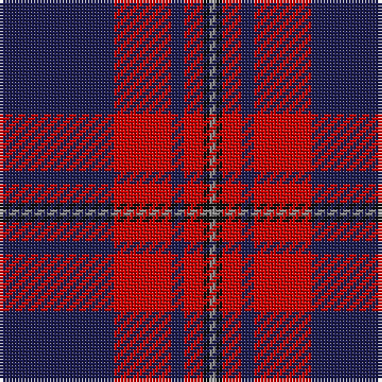

The parent of this is [MacGregor - 2004 (Pipe Band)](/tartans/db/36/r18/db4/r6/k2/n/2/)

This was sourced from tartans-authority.  It is a [6 stripes tartan](/stripes/stripes6/).

Original link http://www.tartansauthority.com/tartan-ferret/display/7691/

## Thread count
DB/36 R18 DB4 R6 K2 N/2

## Palette
Each colour and its ΔE from the base-6 reference it is a variant of.

| Colour | Shade | Base | ΔE (OKLab) |
|---|---|---|---|
| DB |  `#1C1C50` | B  | 0.14 |
| K |  `#101010` | K  | 0.17 |
| N |  `#888888` | R  | 0.24 |
| R |  `#C80000` | R  | 0.00 |

# Sample pattern

ID: /variants/db/36/r18/db4/r6/k2/n/2-db1c1c50-k101010-n888888-rc80000/
