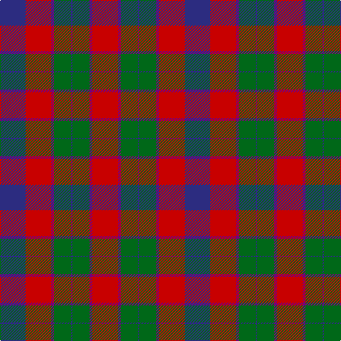

The parent of this is [Wyeth (Personal)](/tartans/db/36/r36/p4/g24/db2/g24/p4/r/36/)

This was sourced from register-of-tartans.  It is a [8 stripes tartan](/stripes/stripes8/).

Original link https://www.tartanregister.gov.uk/tartanDetails.aspx?ref=4787

## Thread count
DB/36 R36 P4 G24 DB2 G24 P4 R/36

## Palette
Each colour and its ΔE from the base-6 reference it is a variant of.

| Colour | Shade | Base | ΔE (OKLab) |
|---|---|---|---|
| DB |  `#2C2C80` | B  | 0.05 |
| G |  `#006818` | G  | 0.02 |
| P |  `#780078` | B  | 0.16 |
| R |  `#C80000` | R  | 0.00 |

# Sample pattern

ID: /variants/db/36/r36/p4/g24/db2/g24/p4/r/36-db2c2c80-g006818-p780078-rc80000/
