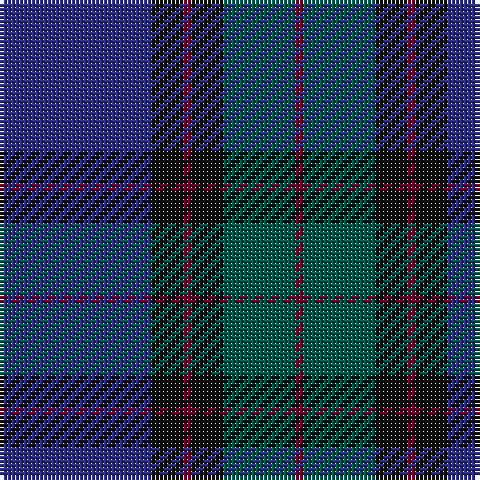

The parent of this is [Monarchs (Corporate)](/tartans/db/38/k8/dr2/k8/g18/dr/2/)

This was sourced from tartans-authority.  It is a [6 stripes tartan](/stripes/stripes6/).

Original link http://www.tartansauthority.com/tartan-ferret/display/2222/

## Thread count
DB/38 K8 DR2 K8 G18 DR/2

## Palette
Each colour and its ΔE from the base-6 reference it is a variant of.

| Colour | Shade | Base | ΔE (OKLab) |
|---|---|---|---|
| DB |  `#2C2C80` | B  | 0.05 |
| DR |  `#680028` | B  | 0.20 |
| G |  `#005448` | G  | 0.11 |
| K |  `#101010` | K  | 0.17 |

# Sample pattern

ID: /variants/db/38/k8/dr2/k8/g18/dr/2-db2c2c80-dr680028-g005448-k101010/
