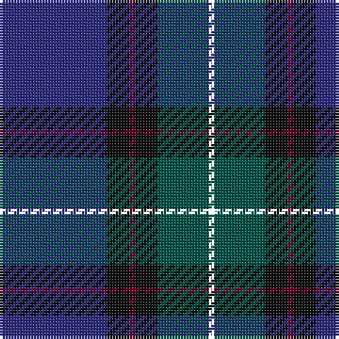

The parent of this is [Monarchs Corporate Sport Tartan Tartan Number: 2222. Earliest known date: 2002 Designed by Enid Brown of Lyle & Scott Ltd for Gleneagles Golf Developments. To be used for golf clothing and accessories. The Monarch's Course, created in the early 1990's by Jack Nicklaus, was renamed The PGA Centenary Course in February 2001 to celebrate the centenary year of The Professional Golfer's Association and is the selected venue for the 2014 Ryder Cup. See products available Copyright © Blair Urquhart, Comrie, 2015](/tartans/db/38/k8/dr2/k8/g18/w/2/)

This was sourced from house-of-tartan.  It is a [6 stripes tartan](/stripes/stripes6/).

Original link http://www.house-of-tartan.scotland.net/house/TartanViewjs.asp?colr=Def&tnam=2222

## Thread count
DB/38 K8 DR2 K8 G18 W/2

## Palette
Each colour and its ΔE from the base-6 reference it is a variant of.

| Colour | Shade | Base | ΔE (OKLab) |
|---|---|---|---|
| DB |  `#2C2C80` | B  | 0.05 |
| DR |  `#680028` | B  | 0.20 |
| G |  `#005448` | G  | 0.11 |
| K |  `#101010` | K  | 0.17 |

# Sample pattern

ID: /variants/db/38/k8/dr2/k8/g18/w/2-db2c2c80-dr680028-g005448-k101010/
