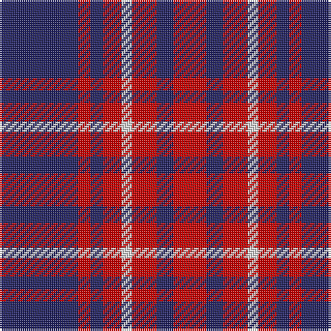

The parent of this is [Edinburgh Marketing Corporate Tartan Tartan Number: 2106. Earliest known date: 1991 The tartan was based on the Drummond tartan after the famous Lord Provost of Edinburgh, Lord Drummond, who is regarded as the father of the New Town and the "bridge" between the Old town of Edinburgh and the New Town. The colours are the corporate colours of Edinburgh Marketing, Navy, Red and White. The tartan was designed by Messrs. Kinloch Anderson of Leith, Edinburgh. See products available Copyright © Blair Urquhart, Comrie, 2015](/tartans/db/38/r6/db6/r9/ln5/r12/db8/r/16/)

This was sourced from house-of-tartan.  It is a [8 stripes tartan](/stripes/stripes8/).

Original link http://www.house-of-tartan.scotland.net/house/TartanViewjs.asp?colr=Def&tnam=2106

## Thread count
DB/38 R6 DB6 R9 LN5 R12 DB8 R/16

## Palette
Each colour and its ΔE from the base-6 reference it is a variant of.

| Colour | Shade | Base | ΔE (OKLab) |
|---|---|---|---|
| DB |  `#202060` | B  | 0.11 |
| LN |  `#E0E0E0` | W  | 0.06 |
| R |  `#C80000` | R  | 0.00 |

# Sample pattern

ID: /variants/db/38/r6/db6/r9/ln5/r12/db8/r/16-db202060-lne0e0e0-rc80000/
