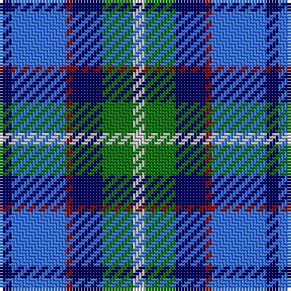

The parent of this is [American Express (Corporate)](/tartans/db/4/b18/dr2/db10/g10/n/4/)

This was sourced from tartans-authority.  It is a [6 stripes tartan](/stripes/stripes6/).

Original link http://www.tartansauthority.com/tartan-ferret/display/2354/

## Thread count
DB/4 B18 DR2 DB10 G10 N/4

## Palette
Each colour and its ΔE from the base-6 reference it is a variant of.

| Colour | Shade | Base | ΔE (OKLab) |
|---|---|---|---|
| B |  `#3474FC` | B  | 0.23 |
| DB |  `#000064` | B  | 0.17 |
| DR |  `#8C0000` | R  | 0.13 |
| G |  `#007800` | G  | 0.06 |
| N |  `#C8C8C8` | W  | 0.13 |

# Sample pattern

ID: /variants/db/4/b18/dr2/db10/g10/n/4-b3474fc-db000064-dr8c0000-g007800-nc8c8c8/
